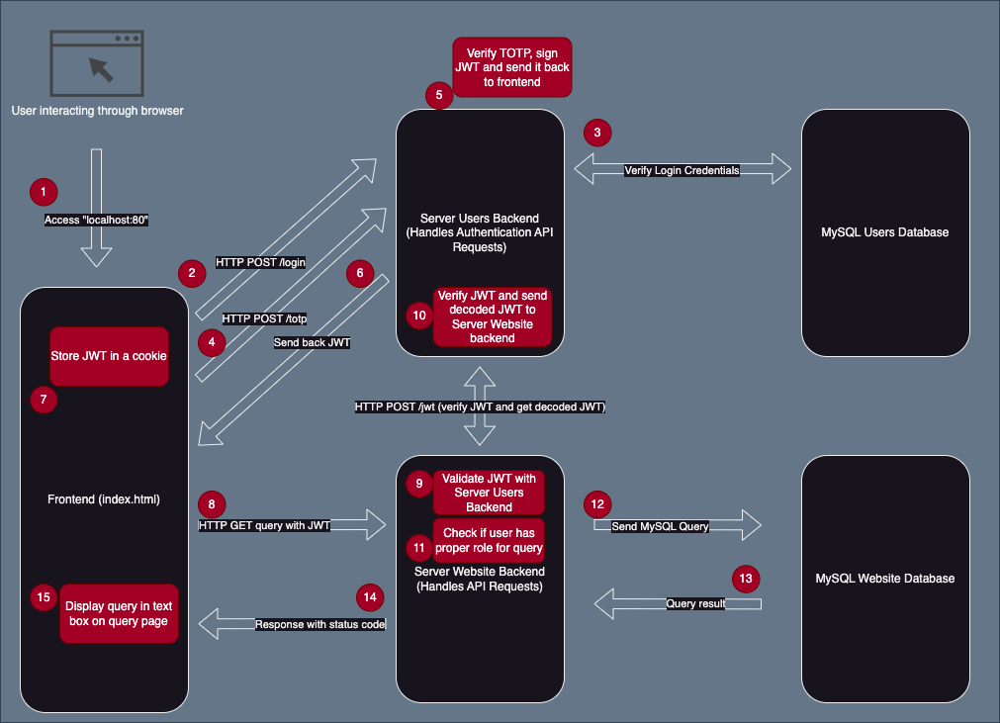

# Table of Contents

1. [NodeJS Application Structure and Data Flow](#nodejs-application-structure-and-data-flow)
2. [Dependencies Modules](#dependencies-modules)
3. [Adding Pepper to Passwords](#adding-pepper-to-passwords)
4. [Bcrypt Integration](#bcrypt-integration)
5. [TOTP Integration](#totp-integration)
5. [JWT Integration](#jwt-integration)
6. [Roles and Permissions](#roles-and-permissions)
7. [Logging](#logging)
8. [Covert Channel](#covert-channel)
9. [Endpoints](#endpoints)
    - [Backend Server Users](#backend-server-users)
    - [Backend Server Website](#backend-server-website)
10. [Docker Compose](#docker-compose)
    - [Handling Website Crashes](#handling-website-crashes)
11. [Application Structure Overview](#application-structure-overview)
    - [server-website](#server-website)
    - [server-users](#server-users)
    - [sql-users](#sql-users)
    - [sql-website](#sql-website)
12. [Steps Required to Access the Information](#steps-required-to-access-the-information)

---

# Contributors
- Cordus Bailey
- David Jara
- Ben Mesiter
- Ethan Dunning
- William Francis
- Lucas Feazel
- Luke McMillan

# Application Overview

The Node.js-based web application is designed to handle user authentication, secure password storage, and database queries. The application comprises multiple containers for modularity and scalability.

To follow the modular route, this website uses CSR(client side rendering) to achieve dynamic page loading on the frontend. Rather than switching to a completely different html file to view a different page, the html of the new page is injected into the index.html for the frontend to display. This allows us to be modular with our webpages and to keep consistence across the different pages using our universal styles.css file. 

The main page consists of a navbar or header, a page-content section where the new html is injected, and a footer for the page. 

# NodeJS Application Structure and Data Flow

The structure for this application is depicted below in the diagram. This diagram shows how the differnt docker containers are layed out and how they communicate with each other. This provides the structure of our application by showing how everything is linked together.


The data flow for this application is shown in the diagram below. There are numbered steps to help guide through the process of how data is passed around the system. The diagram goes into detail on how the differnt containers interact and what they are doing with each other. This gives deeper insight on how the data gets from one point to the next and where checks are conducted to verify the user has logged in or has the proper role to conduct a query.



# Dependencies Modules

The web application depends on the following modules:

1. **MySQL** - Database interaction.
2. **Express** - Backend framework.
3. **unirest** - Simplified HTTP requests.
4. **cors** - Cross-Origin Resource Sharing.
5. **bcrypt** - Password hashing and comparison.
6. **crypto** - Cryptographic functions.
7. **jsonwebtoken** - JWT token generation and verification.
8. **express-session** - Session management.

# Adding Pepper to Passwords

The pepper used by the web server is defined by an environment variable called `PEPPER`. This is configured in the Docker Compose file for the `server-users` container:

```docker
environment:
    - HOST=0.0.0.0
    - PORT=80
    - MYSQLHOST=mysql-users
    - MYSQLUSER=root
    - MYSQLPASS=example
    - PEPPER=ef79
```

# Bcrypt Integration

The `bcrypt` library is used for password hashing and comparison, enhancing security with salt and pepper. The dependency is reflected in the `server/package.json` file:

```json
"dependencies": {
    "bcrypt": "^5.1.1",
    "express": "4.18.2",
    "mysql2": "2.3.3"
}
```

# TOTP Integration

Our website has an integrated TOTP feature for multifactor authentication. When a user register, they are given a generated TOTP secret that is unique to them. After the user has fully registered, they are shown a QR code which they can scan with an authenticator app to access their TOTP codes for login.


After the modal for the QR code is closed, the user is brought to the login page so they can login with their new account.

There is also a standlone NodeJS application that can be used to reaccess the QR Code, and get the TOTP for the user to login. This script is called 'generate-totp.js' and is located in the root directory of the repository. This script however does require you to know the users TOTP secret and username, and the code can be ran with the following command:
```
node generate-totop.js
```


# JWT Integration

The `jsonwebtoken` (JWT) library is used to generate and verify JSON Web Tokens for user authentication. JWTs are issued upon successful login and TOTP verification, stored on the frontend in cookies, and validated on the backend for secure communication.

## Generating JWT in backend

Once a user logs in and provides a valid TOTP code, the backend generates a JWT and sends it to the frontend. Below is an example of the Javascript for this process

```javascript
// Get information about current user account
const { username, email, role } = results[0];

// Generate a JWT containing the username, email, and role
const token = jwt.sign(
    { username, email, role },
    JWTSECRET,
    { expiresIn: '1h' } // Token expiration time
);

//If created token successfully send 200 response with the token
return response.status(200).json({
    message: 'TOTP verified successfully',
    token: token
});
```

## Storing JWT on frontend

Once the JWT is generated, signed, and sent to the frontend to be stored in a cookie. Below is the relevant JavaScript code for this process:

```javascript
// If response is 200, success login
if(response.status == 200) {
    return response.json().then(data => {

        // Get token from response and save as JWT constant
        const JWT = data.token;

        // Sets JWT token value into jwt cookie 
        document.cookie = `jwt=${JWT}; path=/;`;

        // Navigate to where the user should go
        window.navigateTo('/home');
    });
}
```

## Retrieving JWT for Queries

The JWT is retrieved from the cookie on the frontend when making authenticated requests, such as querying the backend. The following code snippet demonstrates this:

```javascript
// Access the cookie and get the JWT
const JWT = document.cookie
    .split('; ')
    .find(row => row.startsWith('jwt='))
    ?.split('=')[1];

// Make a query request with the JWT stored in the cookie
fetch("http://" + parsedUrl.host + "/query", {
    method: "GET",
    credentials: "include", // Needed to pass cookies from session
    headers: {
        'Authorization': `Bearer ${JWT}` // JWT token from cookie
    },
    mode: "cors",
});
```

## Backend JWT Verification

The backend validates the JWT sent with requests to ensure the user is authenticated and authorized. The following code verifies the token:

```javascript
const authHeader = request.headers['authorization'];
if(!authHeader) {
    return response.status(401).send("Missing Authorization Header");
}

const JWT = authHeader.split(' ')[1];
if(!JWT) {
    return response.status(401).send("Invalid Authorization Header Format");
}

// Verify the JWT using the secret stored in the backend
const verificationResult = await verifyJWT(JWT);
if(!verificationResult || !verificationResult.role) {
    return response.status(403).send("Token verification failed");
}
```
This process ensures only authenticated users with valid tokens can access restricted resources.

# Roles and Permissions

User roles define the level of access a user has within the system. Currently, the application supports two roles:

1. **user**: Default role assigned to all users in the `mysql-users` database.
2. **admin**: Elevated role with additional permissions.

### Role-Based Access in Queries

After validating the JWT, the backend extracts the role from the decoded token and checks it against the list of allowed roles for the requested operation. Below is an example of how roles are verified for the query endpoints:
```javascript
// Verify the JWT with the server-users backend
const verificationResult = await verifyJWT(JWT);
if(!verificationResult || !verificationResult.role) {
    return response.status(403).send("Token verification failed");
}

// List roles allowed to use this query
const allowedRoles = ['admin', 'user'];
console.log("User role:", verificationResult.role);

// Check if the user has the correct role
if(allowedRoles.includes(verificationResult.role)) {
    // Conduct the query
}
```

The following table shows the required role needed to use each of the exist queries:
| Query Endpoint | Required Role |
| -------------- | ------------- |
| "/query"       | "user" only       |
| "/query2"      | "user" or "admin" |
| "/query3"      | "admin" only      |
| "/logs"        | "admin" only      |

# Logging

Logging is done every time a user accesses data in one of the query endpoints. The following data is logged for each query:
- UUID: A randomly generated string a char's generated by the UUID library.  The UUID acts as the key of the `logs` table.
- Username: The username of the user accessing the data.
- Log_Date: The date and time that the user accesses the data.
- Log_Data: The name of the page the user accesses.
- Is_Success: Either a `0` or `1` depending on whether or not the user has permission to access the data.

The logs table is in the `Users` database along with the user table.  Logs are added to the table via the `server-users` backend every time a user accesses data on the query endpoints.

To view the logs, one must have an account with `admin` privileges. When this user accesses the `logs` page, they will be able to see the logs collected thus far.


# Covert Channel

A covert channel has been built into the website to provide information to users that know how to access it, or stuble upon it by accident. Either way, there is two aspects to this covert channel integration.

## Initial Finding
For the user to find the intial secret to point them to the private information, they must navigate to the "Window's Sucks" page using the navigation bar at the top of the screen. On this page is a total of four images, but these images has listeners that call a function.

Each image corresponds with a number, and as each image is pressed its number gets added to a sequence list. For example if you pressed the 2nd image, 3rd image, and then 1st image, then your sequence would be [2,3,1]. For our implementation, we have decided to make the sequence 6 numbers long, and the following sequence being the proper input:
```
[1,2,3,4,2,1]
```

Once the user has a sequence equal to the length of 6, it sends an API request to the backend server to verify it and get a response. If the sequence is incorrect, then the server sends back nothing and the user would be none the wiser. But if the sequence is correct, we send some HTML for the frontend to displa, providing the user with private knowledge they can use. The message informs the user they should try using the "cowsay" command on our terminal page.


When the user enter "cowsay" to the terminal on the terminal page, it returns a list of API keys that they user can not use to do what they please with. 


# Endpoints

## Backend Server Users

| Endpoint Name | Purpose |
| ------------- | ------- |
| `/login`      | Verifies user credentials. |
| `/totp`       | Verifies TOTP codes during login. |
| `/jwt`        | Checks the validity of JWT tokens for queries. |
| `/log_entry`  | Enters a new log into the `logs` SQL table. |
| `/log_retrieve`| Retrieves all logs from the `logs` SQL table. |
| `/register`   | Registers a new users account |

## Backend Server Website

| Endpoint Name | Purpose |
| ------------- | ------- |
| `/query`      | Allows users with the `user` role to query a table. |
| `/query2`     | Allows users with the `user` or `admin` role to query a table. |
| `/query3`     | Restricted to users with the `admin` role for database queries. |
| `/logs`       | Restricted to users with the `admin` role for accessing the logs. |
| `/checkSequence`| Used to check if the user entered the correct sequence to get the hidden HTML message. |
| `/terminal`   | Used to get the output of a certain command if the user enters it, to get secret information about the website. |

# Docker Compose

The Docker Compose file defines and configures services for the application, including website, backends, and MySQL databases.

## Handling Website Crashes

To ensure the MySQL databases are fully operational before starting the servers, health checks are implemented:

### MySQL Health Check

```yml
healthcheck:
    test: ["CMD", "mysqladmin", "ping", "-h", "localhost"]
    interval: 10s
    timeout: 5s
    retries: 3
```

### Server Dependency on Database Health

```yml
depends_on:
    [Name of corresponding database container]:
        condition: service_healthy
```

# Application Structure Overview

## Containers

The application consists of four containers:

1. **server-website**: Handles the frontend.
2. **server-users**: Handles user authentication.
3. **sql-users**: Manages user account data.
4. **sql-website**: Manages general application data.

### server-website

This container contains the frontend, structured for dynamic content loading into `index.html`. It includes:

- **index.html**: Main webpage.
- **index.js**: Manages interactions and dynamic content loading.
- **styles.css**: Centralized styling.
- **/pages**: Contains folders for different contents/pages (e.g., `home`, `login`, `register`, `totp`, `logs`). Each folder includes an `.html` and `.js` file for page-specific functionality.

### server-users

The `server-users` container is the backend for user authentication, utilizing Express, JSON Web Tokens, and bcrypt for secure processes. It defines API endpoints for login, registration, and TOTP verification.

### sql-users

The `sql-users` container runs a MySQL server with the `users.sql` file to create a database and a `users` and `logs` table. The tables includes:

#### Users Table

| Username | Password | Role  | Salt  | Email |
| -------- | -------- | ----- | ----- | ----- |

- **Username**: Primary key.
- **Password**: Hashed with bcrypt, salt, and pepper.
- **Role**: Restricts the user's access.
- **Salt**: Randomly generated during registration.
- **Email**: User's linked email.
- **TOTP_Secret**: User's TOTP secret for multifactor authentication

#### Logs Table

| UUID     | Username | Log_Date  | Log_Data  | Is_Success |
| -------- | -------- | ----- | ----- | ----- |

- **UUID**: A randomly generated string a char's generated by the UUID library.  The UUID acts as the key of the `logs` table.
- **Username**: The username of the user accessing the data.
- **Log_Date**: The date and time that the user accesses the data.
- **Log_Data**: The name of the page the user accesses.
- **Is_Success**: Either a `0` or `1` depending on whether or not the user has permission to access the data.

### sql-website

The `sql-website` container runs a MySQL server with the `website.sql` file to create multiple queryable tables. Example tables:

#### things
| thing1 | thing2 | thing3 | thing4 |
| ------ | ------ | ------ | ------ |

#### linux_thoughts
| id       | message1 | message2 | message3 | message4 | message5 | message6 | message7 | message8 | message9 | message10 | 
| -------- | -------- | -------- | -------- | -------- | -------- | -------- | -------- | -------- | -------- | --------- |


#### trashing_windows
| id       | message1 | message2 | message3 | message4 | message5 | message6 | message7 | message8 | message9 | message10 | 
| -------- | -------- | -------- | -------- | -------- | -------- | -------- | -------- | -------- | -------- | --------- |


# Steps Required to Access the Information

1. Run the Docker containers using `docker compose up`.
2. Open a browser and navigate to *localhost*.
3. Click the *login* button.
4. Enter valid credentials to sign in.
5. Generate a TOTP code using the standalone Node.js script.
6. Enter the TOTP code on the redirected page.
7. Select a query page from the home page.
8. Click the *Query* button to execute queries (requires appropriate permissions).
9. Terminate the Docker containers with `docker compose down`.

